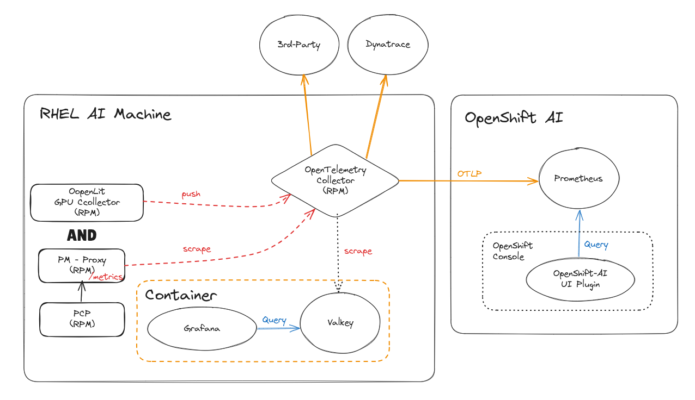

# Telemetry Collection in RHEL AI

## Performance Co-Pilot (PCP)

PCP is a suite of tools, services, and libraries for monitoring, visualizing, storing, and analyzing system-level performance measurements.
PCP is the standard monitoring tool for RHEL systems, and as such is included in RHEL AI.

The easiest way to get up and running with PCP is with the `pcp-zeroconf` package. It includes the `pcp-pmda-openmetrics` plugin that allows for
ingesting any prometheus or OTLP metrics with PCP & Redis as a backend. `Redis` is an in-memory, NoSQL key/value database.

### Install PCP-zeroconf and ensure PCP services are started

```bash
sudo rpm-ostree install pcp-zeroconf
sudo systemctl reboot

cd /var/lib/pcp/pmdas/openmetrics
./Install
```

Upon a reboot, PCP services `pmcd`, `pmlogger`, and `pmproxy` should be running.

**NOTE** The pmcd, pmlogger, and pmproxy services and rpms are installed in the RHEL AI base image. It is possible to start these 3 systemd service
to avoid installing `pcp-zeroconf`.  In future releases, `pcp-zeroconf` package will be included in the base OS image. It simplifies the
management of the PCP services and ensures they remain connected. `pcp-pmda-openmetrics` will also be included in the base OS image. 

#### To resolve SELinux

SELinux policy included with pcp-zeroconf needs an update to enable openmetrics. Until then, to resolve SELinux issues, run this:

See [pcp_openmetrics.te](./rhelai/pcp-selinux/pcp_openmetrics.te)

```bash
checkmodule -M -m -o pcp_openmetrics.mod pcp_openmetrics.te
semodule_package -o pcp_openmetrics.pp -m pcp_openmetrics.mod
semodule -i pcp_openmetrics.pp

systemctl restart pmcd
```

## OpenTelemetry Collector and OpenLit GPU Collector

OpenLit GPU Collector gathers GPU utilization data from AMD or NVIDIA GPUs. The OpenTelemetry Collector creates a unified way to collect 
metrics, logs, and traces and can then export them to various observability backends.

This [telemetry-collector](./telemetry-collector-service/README.md) will run opentelemetry-collector and openlit-gpu-collector podman containers
managed by systemd.


PCP, OpenTelemetry Collector, and OpenLit GPU Collector together provide a complete solution in RHEL AI for collecting system metrics and
all workload metrics, logs, and traces.

# Telemetry Visualization in RHEL AI

All that's required to view metrics in RHEL AI is `Grafana` with `PCP DataSource Plugins` and a `Redis Datastore`.

## Start Redis and Grafana

To keep the number of packages required to install minimal, Redis and Grafana run with podman managed by systemd.
In future releases of RHEL AI, Redis & Grafana rpms could be added to the base OS image. This would avoid needing place the below systemd unit files. 

View the [redis unit file](./redis-service/redis.service) and the [grafana unit file](./grafana-service/grafana.service)
to view the podman commands. Enabling these systemd services ensures that redis and grafana containers will start when the system boots up.

The grafana plugins included with the podman command include PCP Datasources and many preconfigured Grafana Dashboards for visualizing metrics.

### Redis and pmproxy services

Redis container will be started as a systemd service.

```bash
cp ./redis-service/redis.service /etc/systemd/system/redis.service
systemctl daemon-reload
systemctl --enable redis.service --now

# check that redis is up and running and ready to connect with pmproxy
systemctl status redis
podman logs redis
podman volume inspect redis-data #<-podman volume with redis data will persist service restarts

# restart pmproxy to connect to redis
sudo systemctl restart pmproxy

# check that pmproxy and redis are connected by receiving a non-empty response to the below command.
pmseries -p 6379 disk.dev.read
61261618638aa1189c1cc2220815b0cec8c66414
```

### Grafana service

Grafana will be started as a systemd service.

```bash
cp ./grafana-service/grafana.service /etc/systemd/system/grafana.service
systemctl daemon-reload
systemctl --enable grafana.service --now

# check that grafana is running
systemctl status grafana
podman logs grafana
podman volume inspect grafana-data #<-podman volume with grafana-data will persist service restarts
```

### Configure PCP Dashboards in Grafana

Grafana is accessible at `http://ip-addr-local-host:3000`. From the Grafana UI, enable the PCP plugin.
After the PCP plugin is added, use the `Add new Datasource` button to search for `PCP-*` Datasources.
Add the PCP-Redis Datasourse and and from there, import the listed Redis
dashboards. Similarly, the PCP-Vector Datasource can be added and its dashboards imported.


See [AI Workload Monitoring](./workload-monitoring.md) to extend PCP & OpenTelemetry Collector to collect and visualize _all_ workload telemetry,
and also for examples on how to export telemetry to an external observability stack or vendor.
